# ADAPTERS.md — PROJECT HARPY

> Provider rate limits, Terms of Service (TOS), and retention policies.

---

## Provider Data Flow

```mermaid
graph TB
    subgraph Ingest["🔧 harpy-ingest Service"]
        POLL["Polling Scheduler"]
        NORM["Data Normalizer"]
    end
    
    subgraph Providers["📡 External Data Providers"]
        ADSB["ADS-B<br/>(OpenSky)"]
        TLE["TLE/Satellite<br/>(CelesTrak)"]
        SEIS["Seismic<br/>(USGS)"]
        WX["Weather<br/>(NWS)"]
        RADAR["Radar<br/>(NEXRAD)"]
        CAM["Cameras<br/>(Local Fixtures)"]
    end
    
    subgraph Storage["💾 HARPY Storage"]
        REDIS[("Redis<br/>Hot State")]
        PG[("PostgreSQL<br/>Track History")]
        S3[("S3/MinIO<br/>Snapshots")]
    end
    
    subgraph Downstream["⬇️ Downstream Services"]
        RELAY["harpy-relay<br/>WebSocket Fanout"]
        FUSION["harpy-fusion<br/>Alert Generation"]
    end
    
    POLL --> ADSB
    POLL --> TLE
    POLL --> SEIS
    POLL --> WX
    POLL --> RADAR
    POLL --> CAM
    
    ADSB --> NORM
    TLE --> NORM
    SEIS --> NORM
    WX --> NORM
    RADAR --> NORM
    CAM --> NORM
    
    NORM --> REDIS
    NORM --> PG
    NORM --> S3
    
    REDIS --> RELAY
    REDIS --> FUSION
    
    style ADSB fill:#e3f2fd
    style TLE fill:#e3f2fd
    style SEIS fill:#e3f2fd
    style WX fill:#e3f2fd
    style RADAR fill:#e3f2fd
    style CAM fill:#e3f2fd
```

---

## Data Providers

### 1. ADS-B (Automatic Dependent Surveillance-Broadcast)

| Parameter | Value |
|-----------|-------|
| Source | Mock Provider (v0) |
| Rate Limit | 5s polling interval |
| Retention | 24 hours (hot), 30 days (cold) |
| TOS Compliance | Mock data for development only. |
| Failover | Primary: Mock A, Fallback: Mock B |

**Real adapter (optional via `ENABLE_REAL_ADSB=true`):**
- Provider: OpenSky `/api/states/all`
- Auth: OAuth2 client credentials (`OPENSKY_CLIENT_ID`/`OPENSKY_CLIENT_SECRET`) recommended for non-legacy accounts
- Notes: Anonymous mode is supported but constrained:
  - `time` parameter is ignored (most recent state vectors only)
  - Effective time resolution is 10 seconds
  - Approx. 400 API credits/day
  - HARPY enforces a conservative anonymous poll floor via `OPENSKY_ANON_MIN_INTERVAL_SECS` (default 300s)

### 2. Satellite TLE (Two-Line Element)

| Parameter | Value |
|-----------|-------|
| Source | Mock Provider (v0) |
| Rate Limit | 60s polling interval |
| Retention | 30 days |
| TOS Compliance | Mock data for development only. |
| Failover | Primary: Mock A, Fallback: Mock B |

**Real adapter (optional via `ENABLE_REAL_TLE=true`):**
- Provider: CelesTrak GP endpoint (`/NORAD/elements/gp.php?GROUP=...&FORMAT=JSON`)
- Default group: `STATIONS` (configurable via `CELESTRAK_GROUP`)
- Notes: Respect 2-hour update cadence and error-rate blocking policy

### 3. Seismic Events

| Parameter | Value |
|-----------|-------|
| Source | USGS Earthquake Catalog API (GeoJSON) |
| Rate Limit | Poll every 300s (default) |
| Retention | 30 days |
| TOS Compliance | Public open data; attribution recommended |
| Failover | Disabled when API unavailable |

**Real adapter (optional via `ENABLE_REAL_SEISMIC=true`):**
- Provider: `https://earthquake.usgs.gov/fdsnws/event/1/query`
- Mapping: Earthquake events map to `TRACK_KIND_GROUND` tracks
- Filters: `USGS_MIN_MAGNITUDE`, `USGS_LOOKBACK_MINUTES`, optional seismic bbox env vars

### 4. Weather Forecast

| Parameter | Value |
|-----------|-------|
| Source | NWS API (`api.weather.gov`) |
| Rate Limit | Poll every 300s (default) |
| Retention | 7 days (operational) |
| TOS Compliance | User-Agent required; open public API |
| Failover | Disabled when API unavailable |

**Real adapter (optional via `ENABLE_REAL_WEATHER_NWS=true`):**
- Endpoints: `/points/{lat,lon}` + `forecastHourly` URL
- Mapping: Forecast points map to `TRACK_KIND_GROUND` tracks
- Config: `NWS_POINTS`, `NWS_MAX_POINTS`, `NWS_USER_AGENT`

### 5. Weather Radar

| Parameter | Value |
|-----------|-------|
| Source | NEXRAD Level II (AWS open bucket) + NWS radar station metadata |
| Rate Limit | Poll every 300s (default) |
| Retention | 30 days |
| TOS Compliance | NOAA open data; attribution recommended |
| Failover | Disabled when API unavailable |

**Real adapter (optional via `ENABLE_REAL_RADAR_NEXRAD=true`):**
- Buckets: `unidata-nexrad-level2-chunks` (public, no auth)
- Metadata: `https://api.weather.gov/radar/stations`
- Mapping: Radar stations map to `TRACK_KIND_GROUND` tracks
- Config: `NEXRAD_STATIONS`, `NEXRAD_MAX_KEYS_PER_STATION`, `NEXRAD_USER_AGENT`

### 6. Camera Sensors

| Parameter | Value |
|-----------|-------|
| Source | Camera Fixtures (v1) |
| Rate Limit | On-demand stream |
| Retention | 7 days (event-based) |
| TOS Compliance | Strict privacy filters required. |

---

## Provider Configuration Matrix

```mermaid
flowchart LR
    subgraph Config["⚙️ Environment Configuration"]
        ENV_OFF[".env.offline<br/>Development"]
        ENV_ON[".env.online<br/>Production"]
    end
    
    subgraph Mock["🧪 Mock Providers"]
        M_ADSB["Mock ADS-B<br/>20 aircraft"]
        M_TLE["Mock TLE<br/>10 satellites"]
        M_CAM["Mock Cameras"]
    end
    
    subgraph Real["🌍 Real Providers"]
        R_ADSB["OpenSky"]
        R_TLE["CelesTrak"]
        R_SEIS["USGS Seismic"]
        R_WX["NWS Weather"]
        R_RADAR["NEXRAD"]
    end
    
    ENV_OFF -->|All mock| M_ADSB
    ENV_OFF --> M_TLE
    ENV_OFF --> M_CAM
    
    ENV_ON -->|Optional flags| R_ADSB
    ENV_ON --> R_TLE
    ENV_ON --> R_SEIS
    ENV_ON --> R_WX
    ENV_ON --> R_RADAR
    ENV_ON --> M_CAM
```

---

## Retention Policy (Default)

```mermaid
graph LR
    subgraph Tiers["📊 Data Retention Tiers"]
        HOT["🔥 Hot State<br/>Redis<br/>1 hour<br/>Active interpolation"]
        OP["📋 Operational<br/>PostgreSQL<br/>30 days<br/>History & trends"]
        AUDIT["🔒 Audit<br/>PostgreSQL<br/>1 year<br/>Action logs"]
        COLD["❄️ Cold Storage<br/>S3/MinIO<br/>7 years<br/>Compliance"]
    end
    
    DATA["📡 Incoming Data"] --> HOT
    HOT --> OP
    OP --> AUDIT
    OP --> COLD
    
    style HOT fill:#ffebee
    style OP fill:#fff3e0
    style AUDIT fill:#e8f5e9
    style COLD fill:#e3f2fd
```

| Tier | Duration | Purpose |
|------|----------|---------|
| Hot State (Redis) | 1 hour | Active track interpolation |
| Operational (Postgres) | 30 days | History, trends, and alerts |
| Audit (Postgres) | 1 year | Operator and AI action logs |
| Cold Storage (S3) | 7 years | Regulatory compliance |

---

## Circuit Breaker Thresholds

- **Error Rate:** > 50% failures over 10 seconds.
- **Latency:** > 5000ms P99.
- **Reset Timeout:** 30 seconds (Half-Open state).

---

## Provider Compliance Checklist

