# AGENTS.md — PROJECT HARPY

> This file contains essential context for AI coding agents working on PROJECT HARPY.
> Last updated: 2026-02-20

---

## Project Overview

**PROJECT HARPY** is a lawful, compliance-first geospatial intelligence fusion platform. It normalizes heterogeneous sensor feeds (ADS-B, satellite TLE, camera feeds, weather radar, seismic) into a spatiotemporal ontology (nodes + edges) and renders them through a GPU-accelerated tactical HUD.

**Status:** ACTIVE DEVELOPMENT — Phase 0 (repo setup and contracts)

**Author:** Angel L. Pinzon  
**Spec Version:** YC-Grade Build Specification v2.2

### Core Product Differentiators

1. **DVR-native time travel** — scrub through the entire fused picture historically
2. **Explainable fusion** — dynamic ontology graph showing relationships between entities
3. **Deterministic, high-scale rendering** — Cesium Primitives fed by worker-packed TypedArrays
4. **Deploy-anywhere posture** — cloud, GovCloud, or air-gapped edge

### Non-Negotiable Constraints

- **Lawful + compliant usage only** — respect provider terms, privacy laws, operational boundaries
- **All-in Cesium** — globe-to-street continuity; Cesium Entity API forbidden above ~500 objects
- **Strict client data plane** — main thread renders only; workers own parsing, indexing, clustering, packing
- **Binary-first transport** — protobuf frames over WebSocket; JSON only as dev fallback
- **Rust-first backend** — Axum + Tokio; single binaries, predictable latency, no GC pauses
- **Operator-grade reliability** — health model, circuit breakers, backpressure, observability, runbooks

---

## Technology Stack

### Frontend

| Layer | Technology |
|-------|------------|
| Framework | Next.js App Router + React + TypeScript (strict) |
| 3D Rendering | CesiumJS (Primitive API only) |
| Optional 2D | Deck.gl for heatmaps/arcs |
| State Management | Zustand (UI/HUD/scene); React Query (REST only) |
| Post-Processing | Cesium PostProcessStage chain |

### Backend

| Service | Stack | Purpose |
|---------|-------|---------|
| harpy-relay | Axum | WebSocket fanout, auth, rate limits |
| harpy-ingest | Axum + Tokio | Provider adapters, normalization |
| harpy-fusion | Rust | Convergence + rules engine, emits Alerts + Links |
| harpy-graph | Rust | Graph query API over Postgres |
| harpy-aip | Rust or TS | AI Operator Interface |
| harpy-detect | Python (optional) | On-demand CV inference |

### Storage

| Tier | Technology |
|------|------------|
| Hot state | Redis (tracks, sensors, subscriptions) |
| Cold/audit | Postgres (delta index, alerts, link graph, audit logs) |
| Object storage | S3/MinIO (compressed delta segments, snapshots) |
| Graph (hot) | Postgres + H3 cell columns for locality |

### Infrastructure

- Containerization: OCI images, docker-compose (single node), Kubernetes
- Security: mTLS between services, signed JWTs, zero-trust internal
- Observability: Health model, circuit breakers, audit logging

---

## System Architecture

```mermaid
graph TB
    subgraph Frontend["🖥️ Frontend (Next.js + Cesium)"]
        WEB["apps/web"]
        subgraph Workers["⚙️ Worker Pipeline"]
            W1["ws-decode-worker"]
            W2["track-index-worker"]
            W3["cluster-worker"]
            W4["pack-worker"]
        end
        RENDER["Cesium Primitives"]
    end

    subgraph Backend["🔧 Backend Services (Rust/Axum)"]
        RELAY["harpy-relay<br/>WebSocket Fanout"]
        INGEST["harpy-ingest<br/>Provider Adapters"]
        FUSION["harpy-fusion<br/>Rules Engine"]
        GRAPH["harpy-graph<br/>Graph API"]
        AIP["harpy-aip<br/>AI Operator"]
    end

    subgraph Storage["💾 Storage"]
        REDIS[("Redis<br/>Hot State")]
        PG[("PostgreSQL<br/>Cold/Audit")]
        S3[("S3/MinIO<br/>Snapshots")]
    end

    subgraph Providers["📡 Data Providers"]
        ADSB["ADS-B"]
        TLE["TLE/Satellite"]
        CAM["Cameras"]
        SEIS["Seismic"]
        WX["Weather"]
    end

    WEB <-->|"WebSocket<br/>protobuf"| RELAY
    W1 --> W2 --> W3 --> W4 --> RENDER
    
    RELAY --> INGEST
    INGEST --> FUSION
    FUSION --> GRAPH
    RELAY --> AIP
    AIP --> GRAPH
    
    INGEST --> ADSB
    INGEST --> TLE
    INGEST --> CAM
    INGEST --> SEIS
    INGEST --> WX
    
    INGEST --> REDIS
    INGEST --> PG
    FUSION --> PG
    GRAPH --> PG
    INGEST --> S3
```



---

## Project Structure (Planned)

```
HARPY/
├── apps/
│   └── web/                    # Next.js frontend
├── services/
│   ├── harpy-relay/            # WebSocket relay service
│   ├── harpy-ingest/           # Data ingestion service
│   ├── harpy-fusion/           # Fusion/rules engine
│   ├── harpy-graph/            # Graph query API
│   ├── harpy-aip/              # AI Platform service
│   └── harpy-detect/           # Optional CV inference service
├── proto/                      # Protobuf definitions
├── packages/
│   └── shared-types/           # Shared TypeScript types
├── docker-compose.yml          # Local development stack
├── ADAPTERS.md                 # Provider rate limits and TOS compliance
└── README.md                   # Full specification
```

---

## Core Data Model

### Node Entities (Ontology)

| Entity | Description |
|--------|-------------|
| `Track` | Moving object (aircraft, satellite, ground, vessel) |
| `Sensor` | Observation point (camera, radar, seismic station) |
| `Detection` | CV inference tied to a sensor frame |
| `Alert` | Rule/anomaly/convergence event requiring attention |
| `Overlay` | UI-only rendering primitive (no data semantics) |

### Edge Entity: Link

Links connect nodes with typed relationships, enabling graph queries:

```
[Alert] --is_evidenced_by--> [Detection] --captured_by--> [Sensor]
[Track] --observed_by--> [Sensor]
[Track] --associated_with--> [Track]
```

**Link Schema:**

```typescript
interface Link {
  id: string;
  from: { type: 'Track' | 'Sensor' | 'Detection' | 'Alert'; id: string };
  rel:
    | 'observed_by'
    | 'captured_by'
    | 'is_evidenced_by'
    | 'triggers'
    | 'associated_with'
    | string;
  to: { type: 'Track' | 'Sensor' | 'Detection' | 'Alert'; id: string };
  ts_ms: number; // int64 epoch milliseconds
  meta?: object;
}
```

**Rule:** Every Alert MUST carry an evidence chain expressed as Links.

---

## Frontend Architecture

### Worker Pipeline (Client Data Plane)

Workers publish render-ready buffers via Transferable ArrayBuffers. Main thread never receives giant JSON arrays.

| Worker | Responsibility |
|--------|----------------|
| `ws-decode-worker` | protobuf decode, validation, versioning |
| `track-index-worker` | dedup, smoothing, interpolation, H3 bucketing |
| `cluster-worker` | layer-specific clustering rules |
| `pack-worker` | packs float buffers (lat/lon/alt/heading/speed + colors + id map) |

```mermaid
flowchart LR
    WS["📡 WebSocket"] -->|protobuf| W1["ws-decode-worker"]
    W1 -->|decoded| W2["track-index-worker"]
    W2 -->|indexed| W3["cluster-worker"]
    W3 -->|clustered| W4["pack-worker"]
    W4 -->|TypedArrays| MAIN["🎨 Main Thread<br/>Cesium Primitives"]
    
    style WS fill:#e1f5ff
    style W1 fill:#fff4e1
    style W2 fill:#fff4e1
    style W3 fill:#fff4e1
    style W4 fill:#fff4e1
    style MAIN fill:#e8f5e9
```



### TypedArray Render Buffer Contract

```typescript
interface RenderPayload {
  positions: Float32Array;  // [lat, lon, alt] * N
  headings: Float32Array;   // N
  speeds: Float32Array;     // N
  kinds: Uint8Array;        // N (enum)
  colors: Uint8Array;       // [r,g,b,a] * N
  ids: Uint32Array;         // N (index into string table)
  id_table: string[];       // cached, sent rarely
}
```

### UX Surface Components

- **Bottom DVR timeline:** LIVE toggle, scrubber, speed (1x/2x/4x/8x), event markers
- **Top-right DATA LINK:** per-provider freshness + circuit state + WS RTT
- **Right ALERT stack:** severity-ranked, expandable evidence chain (graph)
- **Command palette (Ctrl/Cmd+K):** jump to track/sensor/alert, saved queries, playback
- **Shareable scenes:** URL-encoded state with schema versioning

---

## Backend Architecture

### Streaming Protocol

- **Transport:** WebSocket with protobuf frames
- **Client subscribes by:** viewport + layers + time-range (live or playback)
- **Server emits:**
  - `TrackDeltaBatch` — position updates (droppable under backpressure)
  - `AlertUpsert` — alert state changes (never dropped)
  - `ProviderStatus` — health/freshness updates (never dropped)
  - `SnapshotMeta` — playback snapshot metadata
  - `LinkUpsert` — relationship updates


### Health Model

**Circuit Breaker States:** Closed → Open → HalfOpen → Closed

**Freshness Levels:** Fresh / Aging / Stale / Critical

**Failover:** primary provider → fallback provider (surfaced as ProviderDegraded alert)


### AI Operator Interface (AIP)

The LLM receives schema summaries and uses tool calls to produce SEEK/Filter requests. **Never receives raw camera video.**

**Tools:**

- `seek_to_time(range)`
- `seek_to_bbox(bbox)`
- `set_layers(layer_mask)`
- `run_graph_query(template, params)`

**Guardrails:** allow-list query templates, strict validation, audit log every AI action.

---

## Development Phases

| Phase | Timeline | Deliverables |
|-------|----------|--------------|
| **Phase 0** | 2-3 days | Monorepo, harpy.proto v1, mock providers, docker-compose, CI |
| **Phase 1** | Week 1-2 | Console + live streaming + health (relay, ingest, providers) |
| **Phase 2** | Week 3 | DVR time-travel + snapshots + shareable scenes |
| **Phase 3** | Week 4-6 | Dynamic ontology + fusion alerts + graph queries |
| **Phase 4** | Week 7+ | Enterprise posture (K8s, RBAC, GovCloud), optional CV |


### Current Status: Phase 0

Tasks to complete:

1. [x] Set up monorepo workspace structure
2. [x] Define harpy.proto v1 contracts
3. [x] Create deterministic mock providers (ADS-B + TLE in `harpy-ingest`)
4. [x] Configure docker-compose (postgres + redis + minio)
5. [x] Set up CI (lint/test/build + frontend build + compose smoke checks)

---

## Phase 1 Progress

- [x] Next.js frontend scaffolded in `apps/web` (No Tailwind, Vanilla CSS)
- [x] CesiumJS Primitive API integrated
- [x] Tactical HUD chrome with vision mode chain (EO/CRT/NVG/FLIR)
- [x] Worker-based data plane (`ws-decode -> track-index -> cluster -> pack -> render`)
- [x] Mock data stream for testing pipeline
- [x] Shared Types package `@harpy/shared-types` with generated proto types

---

## Code Style Guidelines

### TypeScript (Frontend)

- Use strict mode
- Prefer explicit types over inference for public APIs
- Use Zustand for state; React Query only for non-streaming REST
- Web Workers must use Transferables, never structured clone for large arrays

### Rust (Backend)

- Axum for HTTP/WebSocket services
- Tokio for async runtime
- Single binary outputs preferred
- Circuit breaker and backpressure patterns required for all external calls

### Protocol Buffers

- All streaming messages must be protobuf
- JSON only as dev fallback
- Versioning strategy: semantic versioning in message envelopes

### General

- No Cesium Entity API above ~500 objects (use Primitive API)
- All provider adapters need ADAPTERS.md documentation (rate limits, TOS)
- Every operator action + AI action must be audit logged

---

## Testing Strategy

### Unit Tests

- Worker logic (parsing, indexing, clustering)
- Protocol encoding/decoding
- Fusion rules engine

### Integration Tests

- WebSocket subscription lifecycle
- Provider adapter error handling
- Circuit breaker behavior

### Performance Tests

- Bundle size monitoring (CI)
- Worker compile time (CI)
- Render frame time budgets (16ms target)

---

## Security Considerations

### Data Handling

- Respect provider terms of service (documented in ADAPTERS.md)
- Privacy law compliance (GDPR, etc.)
- Default minimal data retention
- Per-provider retention policies as code

### Access Control

- mTLS between services
- Signed JWTs for service-to-service auth
- RBAC/ABAC roles (Phase 4)
- Audit logging for all queries, seeks, exports

### AI Safety

- LLM never receives raw video streams
- Tool call allow-list
- Human confirmation required for scene-altering actions
- Transparent explainability (show structured request before execution)

### Deployment Security

- Secrets via environment/secret store (never in frontend)
- Air-gapped mode support (no external calls)
- VPC deployment with WAF and private subnets

---

## Build and Run Commands

### Development

```bash
# Start full backend stack (offline by default)
make dev-up

# Explicit mode selection
make dev-up-offline
make dev-up-online

# Runtime checks
make dev-health
make dev-status
make dev-logs

# Frontend
cd apps/web && npm run dev:offline
cd apps/web && npm run dev:hybrid
cd apps/web && npm run dev:online
```

### CI/CD

```bash
make lint            # ESLint + Clippy
make test            # Jest + cargo test
make build           # Next.js build + cargo build --release
make perf-check      # Bundle size, worker compile time
```

---

## Useful Resources

- [CesiumJS Documentation](https://cesium.com/learn/cesiumjs-learn/)
- [Cesium Primitive API Guide](https://cesium.com/learn/cesiumjs-learn/geometry-appearances/)
- [Axum Web Framework](https://docs.rs/axum/latest/axum/)
- [Tokio Runtime](https://tokio.rs/)
- [H3 Geospatial Indexing](https://h3geo.org/)

---

## Key Documents

| Document | Purpose |
|----------|---------|
| `README.md` | Full YC-grade specification v2.2 |
| `AGENTS.md` | This file — context for AI coding agents |
| `ADAPTERS.md` | Provider rate limits and TOS compliance |
| `proto/harpy/v1/harpy.proto` | Streaming protocol definitions |

---

## Documentation Quality Gates

Before finalizing any docs change, verify:

1. `README.md` and `AGENTS.md` stay consistent on constraints, services, protocol frames, and roadmap phases.
2. Schema snippets are copy-paste friendly (valid TypeScript/Protobuf/Rust syntax where applicable).
3. Quick Start, Tech Stack, and Project Structure remain present and machine-parseable.
4. Non-negotiables remain explicit and unchanged unless intentionally revised.
5. New architectural decisions are reflected in both docs in the same PR.

---

*End of AGENTS.md*
