# HARPY Execution Backlog (Phases 2-4)

Date: 2026-02-20  
Scope: Remaining work after Phase 1 backend milestone claim  
Owners: Claude (Backend), Gemini (Frontend)

---

## Workflow Overview

```mermaid
graph LR
    subgraph Phase1["✅ Phase 1"]
        P1["Live Streaming<br/>+ Health"]
    end
    
    subgraph Phase2["🔜 Phase 2"]
        P2["DVR Time-Travel<br/>+ Snapshots"]
    end
    
    subgraph Phase3["🔜 Phase 3"]
        P3["Fusion Alerts<br/>+ Graph Queries"]
    end
    
    subgraph Phase4["🔜 Phase 4"]
        P4["Enterprise Posture<br/>+ AI Operator"]
    end
    
    P1 --> P2 --> P3 --> P4
    
    style P1 fill:#c8e6c9
    style P2 fill:#fff9c4
    style P3 fill:#ffccbc
    style P4 fill:#e1bee7
```



---

## Rules

- Every item must have a reproducible verification step.
- No item is complete unless acceptance criteria are met.
- Backend and frontend must both pass contract compatibility against `proto/harpy/v1/harpy.proto`.

---

## P0 Blockers (Must Clear First)

```mermaid
graph TB
    subgraph Blockers["🚨 Phase 0 Blockers"]
        B1["P0-1: Fix harpy-fusion<br/>compile failure"]
        B2["P0-2: Align docker-compose<br/>with workflow"]
        B3["P0-3: Sync docs<br/>to reality"]
    end
    
    DONE["✅ All Blockers Resolved"]
    
    B1 --> DONE
    B2 --> DONE
    B3 --> DONE
    
    style B1 fill:#c8e6c9
    style B2 fill:#c8e6c9
    style B3 fill:#c8e6c9
    style DONE fill:#81c784
```



- [x] `P0-1` Fix `harpy-fusion` compile failure (Rust let-chain syntax issue).
  - Owner: Claude
  - Acceptance:
    - `cargo check -p harpy-fusion` passes.
  - Verify:
    - `cargo check -p harpy-fusion`

- [x] `P0-2` Align `docker-compose.yml` with actual multi-service workflow used by teams.
  - Owner: Claude
  - Acceptance:
    - Active services include at least `postgres`, `redis`, `harpy-relay`, `harpy-ingest`, `harpy-fusion`, `harpy-graph`, `harpy-aip`.
  - Verify:
    - `docker-compose config --services`

- [x] `P0-3` Sync docs to reality (`TEAM_ALIGNMENT.md`, `README.md`) after blockers are fixed.
  - Owner: Claude
  - Acceptance:
    - No stale claims about pending work that is already implemented.
  - Verify:
    - Manual review of updated sections.

---

## Backend Phase 2 (Claude)


- [x] `B2-1` Snapshot model + storage contract.
  - Acceptance:
    - Snapshot metadata table or equivalent model exists.
    - Snapshot format documented (fields, compression, timestamps).
  - Verify:
    - Migration present and applied.

- [x] `B2-2` Periodic snapshot creation job.
  - Acceptance:
    - Ingest/worker emits snapshots at configured interval.
    - Failure path logs and retries are handled.
  - Verify:
    - Logs show periodic snapshots; metadata records increase over time.

- [x] `B2-3` Seek API for playback ranges.
  - Acceptance:
    - Endpoint accepts time range + viewport and returns snapshot+delta plan.
  - Verify:
    - `curl` request returns valid JSON with snapshot reference and deltas.

- [x] `B2-4` Relay playback mode support.
  - Acceptance:
    - Relay handles playback subscriptions and routes historical batches.
  - Verify:
    - Playback subscription receives historical `TrackDeltaBatch`.

- [x] `B2-5` Backpressure semantics enforced in code.
  - Acceptance:
    - `TrackDeltaBatch` droppable.
    - `AlertUpsert` and `ProviderStatus` never dropped.
  - Verify:
    - `backpressure.rs` module implements differentiated priority channels.

---

## Frontend Phase 1 Catch-Up (Gemini)

```mermaid
graph LR
    subgraph F1["🎨 Frontend Phase 1 Tasks"]
        F1_1["F1-1: WebSocket +<br/>protobuf decode"]
        F1_2["F1-2: Primitive-only<br/>Cesium rendering"]
        F1_3["F1-3: DATA LINK<br/>health panel"]
        F1_4["F1-4: Layer-based<br/>subscription updates"]
    end
    
    subgraph Frontend["Frontend Stack"]
        WS["WebSocket Client"]
        WORKERS["Web Workers"]
        CESIUM["Cesium Primitives"]
        HUD["DATA LINK Panel"]
    end
    
    F1_1 --> WS
    F1_1 --> WORKERS
    F1_2 --> CESIUM
    F1_3 --> HUD
    F1_4 --> WS
    
    style F1_1 fill:#c8e6c9
    style F1_2 fill:#c8e6c9
    style F1_3 fill:#c8e6c9
    style F1_4 fill:#c8e6c9
```



- [x] `F1-1` WebSocket + protobuf decode loop in workers.
  - Acceptance:
    - Client connects to `ws://localhost:8080/ws`.
    - Decodes envelope + track/provider payloads.
  - Verify:
    - Browser logs and UI state update from live stream.

- [x] `F1-2` Primitive-only Cesium rendering path.
  - Acceptance:
    - Tracks render via Primitive API, no Entity API usage for track sets.
  - Verify:
    - Code review + runtime render check.

- [x] `F1-3` DATA LINK health panel.
  - Acceptance:
    - Displays provider freshness/circuit status and WS status.
  - Verify:
    - Simulated provider state changes visible in HUD.

- [x] `F1-4` Layer-based subscription updates.
  - Acceptance:
    - Layer toggles send updated `SubscriptionRequest` and affect rendering.
  - Verify:
    - Turning layers off stops matching tracks in viewport.

---

## Backend Phase 3 (Claude)

```mermaid
graph TD
    subgraph B3["🔧 Backend Phase 3 Tasks"]
        B3_1["B3-1: Fusion Rules<br/>Engine v1"]
        B3_2["B3-2: Alert + Link<br/>Publication Pipeline"]
        B3_3["B3-3: Graph Query<br/>API Hardened"]
        B3_4["B3-4: Audit Logging<br/>for Actions"]
    end
    
    subgraph Rules["📋 Rule Templates"]
        R1["Proximity Rules"]
        R2["Anomaly Detection"]
        R3["Pattern Matching"]
    end
    
    subgraph Outputs["📤 Outputs"]
        ALERTS["AlertUpsert"]
        LINKS["LinkUpsert"]
        AUDIT["audit_log"]
    end
    
    B3_1 --> Rules
    Rules --> B3_2
    B3_2 --> ALERTS
    B3_2 --> LINKS
    B3_3 --> GRAPH["Graph Query API"]
    B3_4 --> AUDIT
    
    style B3_1 fill:#ffccbc
    style B3_2 fill:#ffccbc
    style B3_3 fill:#ffccbc
    style B3_4 fill:#ffccbc
```



- [ ] `B3-1` Fusion rules engine v1 (beyond baseline convergence).
  - Acceptance:
    - At least 3 rule templates (e.g., convergence, anomaly, proximity).
    - Dedup TTL policy in effect.
  - Verify:
    - Rule tests and generated alerts in `alerts` table.

- [ ] `B3-2` Alert + link publication pipeline.
  - Acceptance:
    - `AlertUpsert`/`LinkUpsert` persisted and published to relay channels.
  - Verify:
    - Redis channel traffic + relay fanout observed.

- [ ] `B3-3` Graph query API hardened.
  - Acceptance:
    - Allow-listed templates only.
    - Pagination + parameter validation.
  - Verify:
    - Positive/negative API tests.

- [ ] `B3-4` Audit logging for operator actions.
  - Acceptance:
    - Graph query actions insert into `audit_log` with actor/action/details.
  - Verify:
    - SQL query on `audit_log` returns expected rows.

---

## Frontend Phase 2-3 (Gemini)

```mermaid
graph TD
    subgraph F23["🎨 Frontend Phase 2-3 Tasks"]
        F2_1["F2-1: DVR Timeline<br/>UI Controls"]
        F2_2["F2-2: Shareable<br/>Scene URLs"]
        F3_1["F3-1: Alert Stack +<br/>Evidence Panel"]
        F3_2["F3-2: Graph Query<br/>UI Templates"]
    end
    
    subgraph Components["🧩 Components"]
        DVR["DVR Timeline"]
        URL["URL State Manager"]
        ALERT["Alert Panel"]
        GRAPH["Graph Query UI"]
    end
    
    F2_1 --> DVR
    F2_2 --> URL
    F3_1 --> ALERT
    F3_2 --> GRAPH
    
    style F2_1 fill:#c8e6c9
    style F2_2 fill:#c8e6c9
    style F3_1 fill:#c8e6c9
    style F3_2 fill:#c8e6c9
```



- [x] `F2-1` DVR timeline (live/scrub/play/speed/event markers).
  - Acceptance:
    - UI controls update playback position and mode.
  - Verify:
    - Time changes reflected in rendered scene.

- [x] `F2-2` Shareable scene URLs.
  - Acceptance:
    - URL encodes/decodes viewport/layers/time mode with schema version.
  - Verify:
    - Open link restores same scene state.

- [x] `F3-1` Alert stack + evidence detail panel.
  - Acceptance:
    - Alerts ordered by severity.
    - Expand shows linked evidence chain.
  - Verify:
    - Live alert appears and chain is inspectable.

- [x] `F3-2` Graph query UI templates.
  - Acceptance:
    - Runs approved templates and renders paginated results.
  - Verify:
    - Query responses match API output.

---

## Backend Phase 4 (Claude)


- [ ] `B4-1` AIP execution guardrails complete.
  - Acceptance:
    - Tool allow-list + strict arg validation + confirmation gate for scene-altering actions.
  - Verify:
    - Tests for blocked tool, invalid args, and missing confirmation.

- [ ] `B4-2` Signed export workflow.
  - Acceptance:
    - Export endpoint issues signed token + watermark metadata.
    - Verification path documented.
  - Verify:
    - Token decodes and includes expected claims.

- [ ] `B4-3` RBAC + ABAC enforcement.
  - Acceptance:
    - Role and attribute checks applied to graph/aip sensitive endpoints.
  - Verify:
    - Unauthorized requests fail; authorized requests pass.

- [ ] `B4-4` Enterprise deployment artifacts validated.
  - Acceptance:
    - Kustomize base + GovCloud overlay apply cleanly.
    - Helm chart renders successfully.
  - Verify:
    - `kubectl kustomize deploy/k8s/base`
    - `kubectl kustomize deploy/k8s/govcloud`
    - `helm template harpy deploy/helm/harpy`

- [ ] `B4-5` Optional `harpy-detect` service integration.
  - Acceptance:
    - On-demand detection endpoint available with privacy filters.
  - Verify:
    - `GET /health` and `POST /detect` smoke tests pass.

---

## Frontend Phase 4 (Gemini)

```mermaid
graph LR
    subgraph F4["🎨 Frontend Phase 4 Tasks"]
        F4_1["F4-1: AI Operator UX<br/>+ Confirmation"]
        F4_2["F4-2: Export UI +<br/>Watermark Visibility"]
        F4_3["F4-3: Role-Aware<br/>UI States"]
    end
    
    subgraph UX["🎯 UX Components"]
        PALETTE["Command Palette"]
        CHAT["Chat Panel"]
        EXPORT["Export Dialog"]
        RBAC["Role Indicators"]
    end
    
    F4_1 --> PALETTE
    F4_1 --> CHAT
    F4_2 --> EXPORT
    F4_3 --> RBAC
    
    style F4_1 fill:#c8e6c9
    style F4_2 fill:#c8e6c9
    style F4_3 fill:#c8e6c9
```



- [x] `F4-1` AI operator UX (palette/chat + structured request preview).
  - Acceptance:
    - Preview appears before apply.
    - Human confirm required for scene mutations.
  - Verify:
    - Confirm gate prevents accidental apply.

- [x] `F4-2` Export UI + watermark visibility.
  - Acceptance:
    - User can request signed export and see watermark metadata.
  - Verify:
    - Export response displayed and downloadable token payload handled.

- [x] `F4-3` Role-aware UI states.
  - Acceptance:
    - Restricted actions hidden/disabled without proper claims.
  - Verify:
    - Role-switch test shows expected capability gating.

---

## Integration Milestones

```mermaid
graph LR
    subgraph Milestones["🔗 Integration Milestones"]
        M1["M1: Live E2E<br/>Ingest → Redis → Relay → Frontend"]
        M2["M2: Alert E2E<br/>Fusion → Redis → Relay → Alert Stack"]
        M3["M3: AI E2E<br/>Frontend → AIP → Graph → Audit Log"]
    end
    
    subgraph Owners["👥 Owners"]
        CLAUDE["Claude"]
        GEMINI["Gemini"]
        CODEX["Codex"]
    end
    
    M1 -.->|Claude + Gemini| CLAUDE
    M1 -.-> GEMINI
    M2 -.->|Codex + Gemini| CODEX
    M2 -.-> GEMINI
    M3 -.->|Codex + Gemini| CODEX
    M3 -.-> GEMINI
    
    style M1 fill:#fff9c4
    style M2 fill:#ffccbc
    style M3 fill:#e1bee7
```



- [ ] `M1` Live E2E: `harpy-ingest -> Redis -> harpy-relay -> frontend`.
  - Owner: Claude + Gemini
  - Verify:
    - Live tracks visible and filtered by viewport/layers.

- [ ] `M2` Alert E2E: `harpy-fusion -> Redis -> harpy-relay -> frontend alert stack`.
  - Owner: Claude + Gemini
  - Verify:
    - Generated alert appears in UI with evidence links.

- [ ] `M3` AI E2E: `frontend -> harpy-aip -> harpy-graph -> audit_log`.
  - Owner: Claude + Gemini
  - Verify:
    - Tool action executes and audit record is persisted.

---

## Weekly Reporting Template

Use this format in standups:

```text
Week of YYYY-MM-DD
- Completed: [IDs]
- In Progress: [IDs]
- Blocked: [IDs + blocker reason]
- Next: [IDs]
```

---

## Task Dependency Graph

```mermaid
graph TD
    subgraph P0["✅ Phase 0"]
        P0_DONE["All Blockers Resolved"]
    end
    
    subgraph P1["✅ Phase 1"]
        F1_ALL["F1-1 → F1-4<br/>Complete"]
    end
    
    subgraph P2["🔜 Phase 2"]
        B2_ALL["B2-1 → B2-5"]
        F2_ALL["F2-1 → F2-2"]
    end
    
    subgraph P3["🔜 Phase 3"]
        B3_ALL["B3-1 → B3-4"]
        F3_ALL["F3-1 → F3-2"]
        M2["M2: Alert E2E"]
    end
    
    subgraph P4["🔜 Phase 4"]
        B4_ALL["B4-1 → B4-5"]
        F4_ALL["F4-1 → F4-3"]
        M3["M3: AI E2E"]
    end
    
    P0_DONE --> P1
    P1 --> P2
    P2 --> P3
    P3 --> P4
    
    B2_ALL --> F2_ALL
    F2_ALL --> M1["M1: Live E2E"]
    
    B3_ALL --> F3_ALL
    F3_ALL --> M2
    
    B4_ALL --> F4_ALL
    F4_ALL --> M3
    
    style P0_DONE fill:#81c784
    style F1_ALL fill:#81c784
    style B2_ALL fill:#c8e6c9
    style F2_ALL fill:#c8e6c9
    style B3_ALL fill:#ffccbc
    style F3_ALL fill:#ffccbc
    style B4_ALL fill:#ffccbc
    style F4_ALL fill:#ffccbc
```


