# 🦅 HARPY Team Alignment Document

**Date:** 2026-02-20
**Purpose:** Coordinate work between Claude (backend Phases 0-2), Gemini (frontend all phases), and Codex (backend Phases 3-4)

---

## Team Division of Responsibilities

| Team | Responsibility | Status |
|------|---------------|--------|
| **Claude (Me)** | Phase 0 + Phase 1-2 Backend Infrastructure | ✅ Phase 0 Complete, ✅ Phase 1 Complete |
| **Gemini** | Frontend (All Phases) | 🔜 Ready to Start |
| **Codex** | Phase 3-4 Backend (Fusion + Graph + AI) | 🔜 Ready to Start |

```mermaid
graph LR
    subgraph Teams["👥 Team Responsibilities"]
        C["🤖 Claude<br/>Backend Phase 0-2"]
        G["🌟 Gemini<br/>Frontend All Phases"]
        X["📚 Codex<br/>Backend Phase 3-4"]
    end
    
    subgraph Deliverables["📦 Key Deliverables"]
        D1["Relay + Ingest<br/>Services"]
        D2["Cesium HUD<br/>WebSocket Pipeline"]
        D3["Fusion + Graph<br/>+ AI Operator"]
    end
    
    C --> D1
    G --> D2
    X --> D3
    
    style C fill:#e3f2fd
    style G fill:#f3e5f5
    style X fill:#e8f5e9
```



---

## Phase 0: Foundation (✅ COMPLETE - Claude)

### What Was Delivered

**Backend Infrastructure:**
- ✅ Cargo workspace with 8 crates (3 shared + 5 services)
- ✅ Complete protobuf schema (harpy.proto v1.0)
- ✅ harpy-relay: WebSocket server (port 8080)
- ✅ harpy-ingest: Data ingestion with mock providers (port 8081)
- ✅ harpy-fusion: Scaffold (port 8082)
- ✅ harpy-graph: Scaffold (port 8083)
- ✅ harpy-aip: Scaffold (port 8084)
- ✅ Database schema (Postgres migrations)
- ✅ Docker-compose (postgres + redis + all services)
- ✅ CI/CD (GitHub Actions)
- ✅ Mock providers: ADS-B (20 aircraft), TLE (10 satellites)

**Critical Files for All Teams:**
- `proto/harpy/v1/harpy.proto` - **Shared contract between frontend & backend**
- `docker-compose.yml` - **Local development environment**
- `migrations/001_initial_schema.sql` - **Database schema**
- `ADAPTERS.md` - **Provider compliance documentation**

---

## Phase 1: Live Streaming + Health (✅ COMPLETE - Claude Backend + Gemini Frontend)

### Claude's Backend Work (✅ Complete)

**harpy-ingest enhancements:**
- ✅ Redis persistence (tracks with 1hr TTL)
- ✅ Redis pub/sub (publish track batches to "tracks:updates" channel)
- ✅ Postgres persistence (track_deltas + tracks tables)
- ✅ Provider health status emissions

**harpy-relay enhancements (✅ Complete):**
- ✅ WebSocket subscription registry (`subscription.rs`)
- ✅ Decode protobuf SubscriptionRequest messages
- ✅ Subscribe to Redis pub/sub channel (`redis_subscriber.rs`)
- ✅ Fanout TrackDeltaBatch to subscribed clients
- ✅ Filter tracks by viewport + layers
- ✅ Metrics endpoint (`/metrics`)

### Verification Commands

```bash
# Start infrastructure
docker-compose up -d

# Build and run services
cargo run -p harpy-relay    # Port 8080 (WebSocket endpoint)
cargo run -p harpy-ingest   # Port 8081 (generates mock data)

# Test WebSocket (in another terminal)
# Connect to: ws://localhost:8080/ws
# Send protobuf SubscriptionRequest, receive TrackDeltaBatch
```

### Gemini's Frontend Work (🔜 Can Start Now)

**Frontend Shell (`apps/web/`):**
- 🔜 Next.js 14+ App Router setup
- 🔜 CesiumJS integration (Primitive API only, NO Entity API)
- 🔜 WebSocket client connection to `ws://localhost:8080/ws`
- 🔜 Protobuf decoding (use generated types from harpy-proto)
- 🔜 Worker pipeline:
  - `ws-decode-worker`: Decode protobuf Envelope messages
  - `track-index-worker`: Dedup, smoothing, H3 bucketing
  - `cluster-worker`: Layer-specific clustering
  - `pack-worker`: Pack TypedArrays for Cesium Primitives
- 🔜 HUD Components:
  - **Top-right DATA LINK**: Per-provider freshness + circuit state
  - **Layer toggles**: Aircraft, Satellite, Ground, Vessel, Camera
  - **Health endpoint**: Call `/health` on all services
- 🔜 Vision mode chain (EO/CRT/NVG/FLIR) using PostProcessStage

**Protobuf Integration:**
```typescript
// Frontend will decode these message types:
import { Envelope, TrackDeltaBatch, ProviderStatus } from '@harpy/proto';

// Subscribe to tracks
const subscription: SubscriptionRequest = {
  viewport: { min_lat: 37.0, max_lat: 38.0, min_lon: -123.0, max_lon: -121.0 },
  layers: [LayerType.LAYER_TYPE_AIRCRAFT, LayerType.LAYER_TYPE_SATELLITE],
  time_range: { live: {} },
  mode: SubscriptionMode.SUBSCRIPTION_MODE_LIVE
};

// Send via WebSocket
ws.send(Envelope.encode({ subscription_request: subscription }).finish());
```

---

## Phase 2: DVR Time-Travel + Playback (🔜 NEXT - Claude Backend + Gemini Frontend)

### Claude's Backend Work (After Phase 1)

**harpy-ingest enhancements:**
- 🔜 Snapshot creation (every N minutes)
- 🔜 Snapshot storage (S3/MinIO or local filesystem)
- 🔜 Snapshot metadata in Postgres (snapshots table)

**harpy-relay enhancements:**
- 🔜 Playback mode support
- 🔜 `/seek` API endpoint:
  - `GET /seek?start_ts_ms=X&end_ts_ms=Y&bbox=...`
  - Returns snapshot + delta ranges
- 🔜 Serve historical TrackDeltaBatch from Postgres

### Gemini's Frontend Work (After Phase 1)

**DVR Timeline Components:**
- 🔜 Bottom timeline UI:
  - LIVE toggle
  - Scrubber (seek to timestamp)
  - Play/pause controls
  - Speed controls (1x, 2x, 4x, 8x)
  - Event markers (alerts)
  - Seek latency badge
- 🔜 Shareable scene URLs (encode state to URL params)
- 🔜 Playback rendering from snapshots
- 🔜 Satellite propagation against playback clock (TLE orbit calculation)

---

## Phase 3: Fusion Alerts + Graph Queries (🔜 CODEX BACKEND + Gemini Frontend)

### Codex's Backend Work

**harpy-fusion enhancements:**
- 🔜 H3 cell bucketing for convergence detection
- 🔜 Rules engine with templates:
  - Proximity rules (aircraft too close)
  - Anomaly detection (unexpected speed/altitude changes)
  - Pattern matching (circular patterns, loitering)
- 🔜 Alert generation (AlertUpsert messages)
- 🔜 Link creation (evidence chains: Alert → Detection → Sensor → Track)
- 🔜 Alert deduplication (TTL-based)
- 🔜 Emit alerts to Redis pub/sub channel ("alerts:updates")

**harpy-graph enhancements:**
- 🔜 Pre-approved query templates:
  - "Find all tracks observed by sensor X"
  - "Get evidence chain for alert Y"
  - "Find associated tracks (within distance)"
- 🔜 Graph traversal implementation
- 🔜 Pagination support
- 🔜 `/graph/query` endpoint with template validation

**Database additions:**
- 🔜 Populate `alerts` table
- 🔜 Populate `links` table
- 🔜 Populate `alert_evidence` junction table

### Gemini's Frontend Work

**Alert UI Components:**
- 🔜 Right-rail Alert Stack:
  - Severity-ranked list
  - Expandable evidence chain visualization
  - Link graph rendering (D3.js or similar)
- 🔜 Alert details panel:
  - Title, description, timestamp
  - Evidence graph (Alert → Detection → Sensor → Track)
  - Quick actions (acknowledge, resolve)

---

## Phase 4: Enterprise Posture + AI Operator (🔜 CODEX BACKEND + Gemini Frontend)

### Codex's Backend Work

**harpy-aip enhancements:**
- 🔜 AI tool implementations:
  - `seek_to_time(range)` - Trigger playback seek
  - `seek_to_bbox(bbox)` - Pan camera to region
  - `set_layers(layer_mask)` - Toggle layer visibility
  - `run_graph_query(template, params)` - Execute safe queries
- 🔜 Input validation (guardrails)
- 🔜 Audit logging (all AI actions to audit_log table)
- 🔜 `/aip/query` endpoint with LLM integration

**Infrastructure:**
- 🔜 Kubernetes manifests (deployment, service, ingress)
- 🔜 Helm charts with values for prod/staging/dev
- 🔜 GovCloud profile (hardened security)
- 🔜 RBAC/ABAC roles
- 🔜 Signed exports with watermarking

**Optional (harpy-detect):**
- 🔜 On-demand CV inference service (Python + PyTorch/TensorFlow)
- 🔜 Privacy filters (blur faces, license plates)

### Gemini's Frontend Work

**AI Operator UI:**
- 🔜 Command palette (Ctrl/Cmd+K):
  - Natural language queries
  - Saved queries
  - Playback commands
- 🔜 Chat panel with structured request preview
- 🔜 Explain mode (show tool calls before execution)
- 🔜 Human confirmation for scene-altering actions

**Enterprise Features:**
- 🔜 Export functionality (snapshots, time-ranges)
- 🔜 Watermarking on exports
- 🔜 RBAC UI (role management)

---

## Critical Integration Points

### 1. Protobuf Contract (`proto/harpy/v1/harpy.proto`)

**This is the shared contract between all teams.**

**Message Flow:**


**Gemini:** Use generated TypeScript types (will need to run protoc)
**Codex:** Use existing Rust types from `harpy-proto` crate

### 2. Redis Pub/Sub Channels

| Channel | Publisher | Subscriber | Payload |
|---------|-----------|------------|---------|
| `tracks:updates` | harpy-ingest | harpy-relay | JSON array of TrackDelta |
| `alerts:updates` | harpy-fusion | harpy-relay | JSON AlertUpsert |
| `provider:status:*` | harpy-ingest | harpy-relay | JSON ProviderStatus |

**Gemini:** Receives final messages via WebSocket (already decoded)
**Codex:** Publishes to these channels for relay to fanout


### 3. Database Tables

**Shared schema (already created):**
- `tracks` - Current track state (Claude writes, Codex may read)
- `track_deltas` - Time-series history (Claude writes, all may read)
- `alerts` - **Codex writes**, Gemini reads via WebSocket
- `links` - **Codex writes**, Gemini queries via graph API
- `alert_evidence` - **Codex writes**
- `provider_status` - Claude writes, Gemini reads
- `audit_log` - **Codex writes** (AI actions)

### 4. API Endpoints

| Service | Endpoint | Method | Owner | Consumer |
|---------|----------|--------|-------|----------|
| harpy-relay | `/ws` | WebSocket | Claude | Gemini |
| harpy-relay | `/health` | GET | Claude | All |
| harpy-relay | `/seek` (Phase 2) | GET | Claude | Gemini |
| harpy-ingest | `/health` | GET | Claude | All |
| harpy-fusion | `/health` | GET | Codex | All |
| harpy-graph | `/graph/query` | POST | Codex | Gemini |
| harpy-aip | `/aip/query` | POST | Codex | Gemini |

---

## Development Workflow

### Setup (All Teams)

```bash
# Clone repo
git clone <repo-url>
cd HARPY

# Install protoc (required for all)
brew install protobuf  # macOS
# or
sudo apt-get install protobuf-compiler  # Linux

# Start infrastructure
make dev-up  # Starts postgres + redis

# Backend services (Claude's work runs automatically)
cargo run -p harpy-relay    # Port 8080
cargo run -p harpy-ingest   # Port 8081
cargo run -p harpy-fusion   # Port 8082 (Codex will enhance)
cargo run -p harpy-graph    # Port 8083 (Codex will enhance)
cargo run -p harpy-aip      # Port 8084 (Codex will enhance)

# Frontend (Gemini's work)
cd apps/web
npm install
npm run dev  # Port 3000 (typical)
```

### Testing Integration

**Step 1: Verify Backend (Claude's Phase 0-1)**
```bash
# Health checks
curl http://localhost:8080/health  # harpy-relay
curl http://localhost:8081/health  # harpy-ingest

# Check Redis (tracks should appear every 5 seconds)
docker exec -it harpy-redis redis-cli
> KEYS track:*
> GET track:MOCK-AC-000

# Check Postgres (deltas should accumulate)
docker exec -it harpy-postgres psql -U harpy -d harpy
> SELECT COUNT(*) FROM track_deltas;
> SELECT COUNT(*) FROM tracks;
```

**Step 2: Verify Frontend WebSocket (Gemini)**
```javascript
// In browser console or test file
const ws = new WebSocket('ws://localhost:8080/ws');
ws.onopen = () => console.log('Connected');
ws.onmessage = (event) => console.log('Received:', event.data);
```

**Step 3: Verify Fusion (Codex Phase 3)**
```bash
# Check alerts table (after Codex implements fusion)
docker exec -it harpy-postgres psql -U harpy -d harpy
> SELECT * FROM alerts;
> SELECT * FROM links;
```

**Step 4: Verify Graph Queries (Codex Phase 3)**
```bash
curl -X POST http://localhost:8083/graph/query \
  -H "Content-Type: application/json" \
  -d '{"template": "get_evidence_chain", "params": {"alert_id": "ALERT-001"}}'
```

---

## Alignment Verification Checklist

```mermaid
graph TD
    P0["✅ Phase 0 Complete"] --> P1["✅ Phase 1 Complete"]
    P1 --> P2["🔜 Phase 2 DVR"]
    P2 --> P3["🔜 Phase 3 Fusion"]
    P3 --> P4["🔜 Phase 4 Enterprise"]
    
    subgraph P0Items["Phase 0 Deliverables"]
        P0_1["Protobuf Schema"]
        P0_2["Database Schema"]
        P0_3["Mock Providers"]
        P0_4["Docker Compose"]
        P0_5["CI/CD Pipeline"]
    end
    
    subgraph P1Items["Phase 1 Deliverables"]
        P1_1["Redis Persistence"]
        P1_2["WebSocket Relay"]
        P1_3["Frontend Connection"]
        P1_4["Health Dashboard"]
    end
    
    subgraph P2Items["Phase 2 Deliverables"]
        P2_1["Snapshot System"]
        P2_2["Seek API"]
        P2_3["DVR Timeline"]
        P2_4["Shareable URLs"]
    end
    
    subgraph P3Items["Phase 3 Deliverables"]
        P3_1["Fusion Rules"]
        P3_2["Alert System"]
        P3_3["Graph Queries"]
        P3_4["Evidence Chains"]
    end
    
    subgraph P4Items["Phase 4 Deliverables"]
        P4_1["AI Operator"]
        P4_2["Kubernetes"]
        P4_3["RBAC System"]
        P4_4["GovCloud Profile"]
    end
```



### Phase 0 (✅ Complete)
- [x] Protobuf schema defines all message types
- [x] Database schema supports all phases
- [x] Mock providers generate deterministic data
- [x] Docker-compose provides local development environment
- [x] CI/CD pipeline validates code quality

### Phase 1 (✅ Complete)
- [x] harpy-ingest stores tracks in Redis
- [x] harpy-ingest stores deltas in Postgres
- [x] harpy-ingest publishes to Redis pub/sub
- [x] harpy-relay subscribes to Redis pub/sub
- [x] harpy-relay decodes SubscriptionRequest from frontend
- [x] harpy-relay fanouts TrackDeltaBatch to clients
- [x] harpy-relay filters tracks by viewport and layers
- [ ] Frontend connects to WebSocket (Gemini)
- [ ] Frontend decodes protobuf messages (Gemini)
- [ ] Frontend renders tracks on Cesium globe (Gemini)
- [ ] DATA LINK panel shows provider health (Gemini)

### Phase 2 (🔜 Next)
- [ ] harpy-ingest creates snapshots
- [ ] harpy-relay serves playback data
- [ ] Frontend DVR timeline implemented
- [ ] Shareable scene URLs working

### Phase 3 (🔜 Codex + Gemini)
- [ ] harpy-fusion generates alerts
- [ ] harpy-fusion creates links
- [ ] harpy-graph query templates implemented
- [ ] Frontend alert panel shows evidence chains

### Phase 4 (🔜 Codex + Gemini)
- [ ] harpy-aip AI tools implemented
- [ ] Frontend command palette working
- [ ] Kubernetes deployment ready

---

## Key Files for Each Team

### Claude (Backend Phase 0-2)
**Primary files:**
- `services/harpy-relay/src/main.rs` ✅ Created
- `services/harpy-ingest/src/main.rs` ✅ Enhanced (Phase 1)
- `services/harpy-ingest/src/storage/` ✅ New (Phase 1)
- `proto/harpy/v1/harpy.proto` ✅ Shared contract

### Gemini (Frontend All Phases)
**Primary files:**
- `apps/web/` (entire frontend - to be created)
- `proto/harpy/v1/harpy.proto` ✅ Shared contract (generate TS types)
- Generated TypeScript types from protobuf

### Codex (Backend Phase 3-4)
**Primary files:**
- `services/harpy-fusion/src/main.rs` ✅ Scaffold ready
- `services/harpy-graph/src/main.rs` ✅ Scaffold ready
- `services/harpy-aip/src/main.rs` ✅ Scaffold ready
- `crates/harpy-proto/` ✅ Use existing types
- `proto/harpy/v1/harpy.proto` ✅ Shared contract

---

## Communication Protocol

**All teams use the same protobuf schema:**
```
proto/harpy/v1/harpy.proto
```

**To regenerate types:**
```bash
# Rust (automatic via build.rs)
cargo build -p harpy-proto

# TypeScript (Gemini needs to set this up)
protoc --plugin=protoc-gen-ts_proto=./node_modules/.bin/protoc-gen-ts_proto \
  --ts_proto_out=./apps/web/src/proto \
  --ts_proto_opt=esModuleInterop=true \
  ./proto/harpy/v1/harpy.proto
```

---

## Success Criteria

**Phase 0 (✅ DONE):**
- Backend infrastructure complete
- Services can run locally
- CI/CD validates code

**Phase 1 (🔄 NEXT):**
- Frontend shows live aircraft tracks on globe
- DATA LINK panel shows provider health (Fresh/Aging/Stale/Critical)
- Layer toggles filter tracks

**Phase 2:**
- DVR timeline allows scrubbing through history
- Shareable URLs restore scene state

**Phase 3:**
- Alerts appear in right-rail panel
- Evidence chains visualize relationships
- Graph queries return linked data

**Phase 4:**
- AI operator can query scene via natural language
- Kubernetes deployment works in GovCloud
- RBAC enforces access control

---

**Status:** Phase 0 ✅ Complete | Phase 1 ✅ Complete | Phase 2 🔄 In Progress | Phases 3-4 🔜 Ready

**P0 Blockers (Complete):**
- ✅ P0-1: Fixed harpy-fusion compile failure (let-chain syntax)
- ✅ P0-2: Aligned docker-compose.yml with all 7 services
- ✅ P0-3: Docs synced

**Next Steps:**
1. Claude: Complete Phase 2 backend (B2-1 through B2-5)
2. Gemini: Continue frontend development (Phase 1 catch-up + Phase 2)
3. Codex: Begin Phase 3 when Phase 2 backend stabilizes
