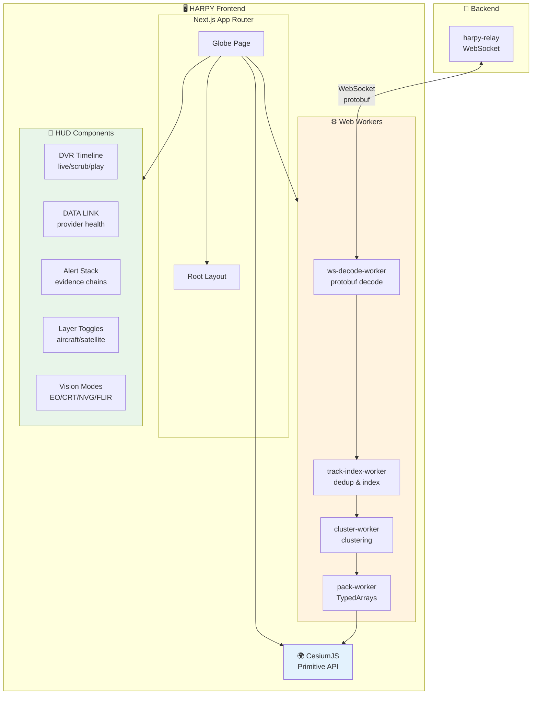
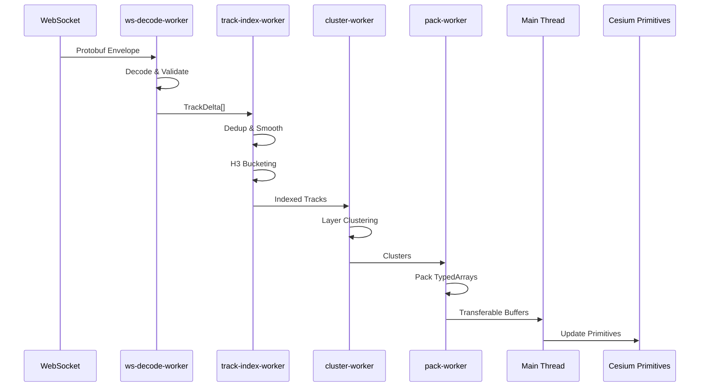
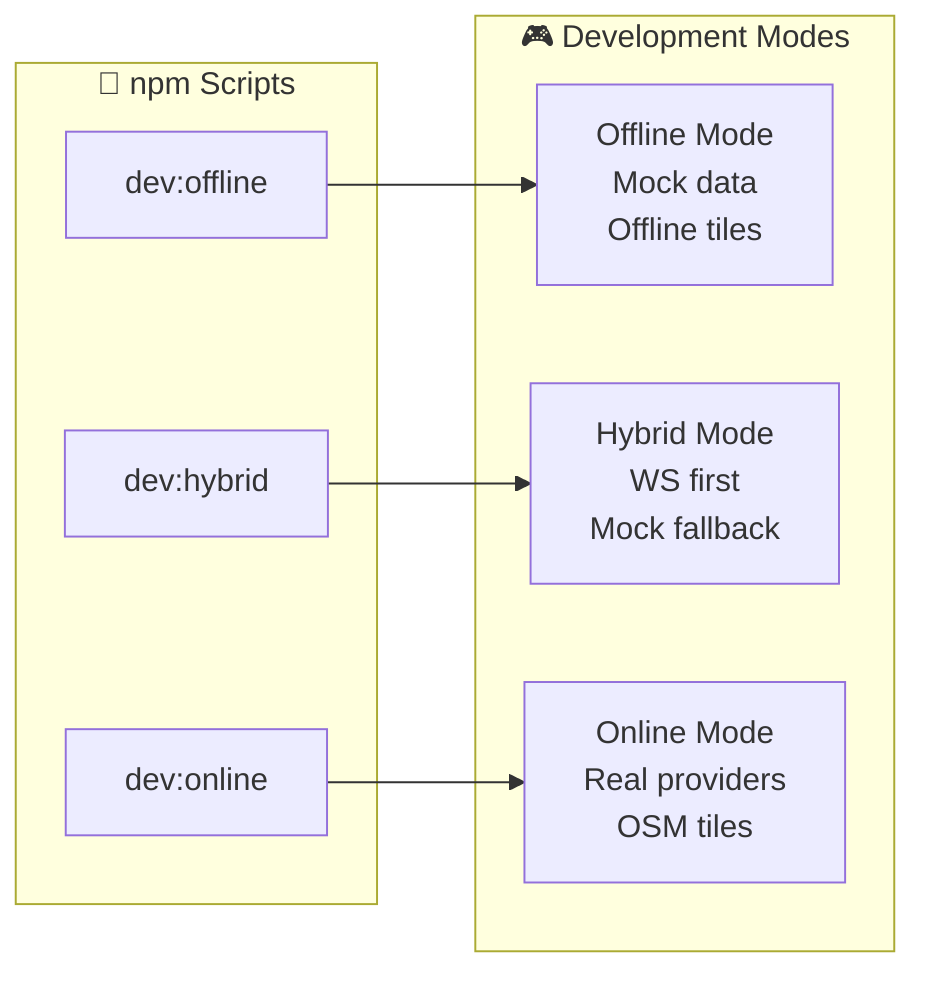
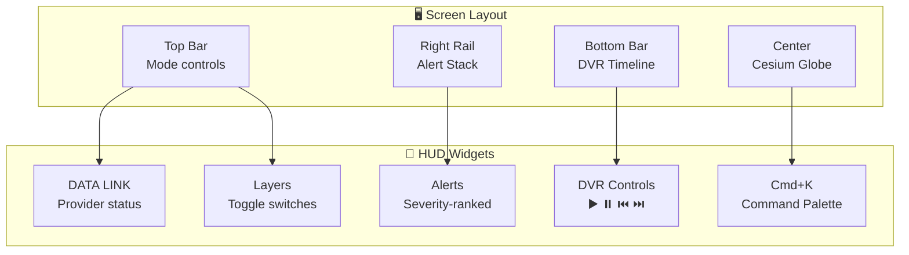
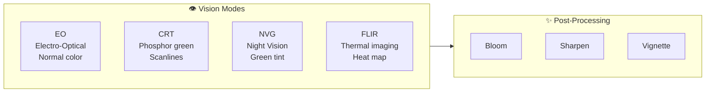

# HARPY Frontend

Next.js 14+ frontend for PROJECT HARPY with CesiumJS integration.

## Architecture



## Worker Pipeline

The frontend uses a strict client data plane with Web Workers for all heavy processing:



| Worker | Responsibility |
|--------|----------------|
| `ws-decode-worker` | Protobuf decode, validation, versioning |
| `track-index-worker` | Dedup, smoothing, interpolation, H3 bucketing |
| `cluster-worker` | Layer-specific clustering rules |
| `pack-worker` | Pack float buffers for Cesium Primitives |

## Getting Started

### Prerequisites

- Node.js 20+
- Protocol Buffer compiler (`protoc`)
- Backend services running (see root README)

### Installation

```bash
# Install dependencies
npm install

# Generate protobuf types (requires protoc)
npm run proto:generate

# Start development server (offline mode)
npm run dev:offline

# Or hybrid mode
npm run dev:hybrid

# Or online mode
npm run dev:online
```

### Development Modes



| Mode | Command | Description |
|------|---------|-------------|
| Offline | `npm run dev:offline` | Uses mock data, offline Cesium tiles |
| Hybrid | `npm run dev:hybrid` | WebSocket first, falls back to mock |
| Online | `npm run dev:online` | Real providers, online OSM tiles |

### WebSocket Connection

```typescript
// Connect to harpy-relay WebSocket
const ws = new WebSocket('ws://localhost:8080/ws');

// Subscribe to tracks
const subscription = {
  viewport: {
    min_lat: 37.0,
    max_lat: 38.0,
    min_lon: -123.0,
    max_lon: -121.0
  },
  layers: [
    LayerType.LAYER_TYPE_AIRCRAFT,
    LayerType.LAYER_TYPE_SATELLITE
  ],
  time_range: { live: {} },
  mode: SubscriptionMode.SUBSCRIPTION_MODE_LIVE
};

// Send via WebSocket
ws.send(Envelope.encode({ subscription_request: subscription }).finish());
```

## HUD Components



### Vision Modes

The frontend supports tactical vision modes via Cesium PostProcessStage:



| Mode | Description |
|------|-------------|
| EO | Electro-Optical (normal color) |
| CRT | CRT/phosphor green with scanlines |
| NVG | Night vision green tint |
| FLIR | Thermal imaging heat map |

## Project Structure

```
app/
├── layout.tsx          # Root layout with providers
├── page.tsx            # Main globe page
├── globals.css         # Global styles (no Tailwind)
├── workers/
│   ├── ws-decode.worker.ts
│   ├── track-index.worker.ts
│   ├── cluster.worker.ts
│   └── pack.worker.ts
├── components/
│   ├── hud/
│   │   ├── DvrTimeline.tsx
│   │   ├── DataLink.tsx
│   │   ├── AlertStack.tsx
│   │   └── LayerToggles.tsx
│   └── cesium/
│       ├── CesiumViewer.tsx
│       └── VisionModeControls.tsx
├── lib/
│   ├── protobuf.ts     # Protobuf utilities
│   └── cesium.ts       # Cesium helpers
└── types/
    └── index.ts        # TypeScript types
```

## Build

```bash
# Production build
npm run build

# Static export
npm run export

# Type check
npm run type-check

# Lint
npm run lint
```

## Learn More

- [CesiumJS Documentation](https://cesium.com/learn/cesiumjs-learn/)
- [Cesium Primitive API Guide](https://cesium.com/learn/cesiumjs-learn/geometry-appearances/)
- [Next.js Documentation](https://nextjs.org/docs)
