# HARPY Frontend

Next.js 14+ frontend for PROJECT HARPY with CesiumJS integration.

## Architecture

```mermaid
graph TD
    subgraph Frontend["🖥️ HARPY Frontend"]
        subgraph App["Next.js App Router"]
            LAYOUT["Root Layout"]
            PAGE["Globe Page"]
        end
        
        subgraph Workers["⚙️ Web Workers"]
            W1["ws-decode-worker<br/>protobuf decode"]
            W2["track-index-worker<br/>dedup & index"]
            W3["cluster-worker<br/>clustering"]
            W4["pack-worker<br/>TypedArrays"]
        end
        
        subgraph HUD["🎯 HUD Components"]
            DVR["DVR Timeline<br/>live/scrub/play"]
            DATALINK["DATA LINK<br/>provider health"]
            ALERTS["Alert Stack<br/>evidence chains"]
            LAYERS["Layer Toggles<br/>aircraft/satellite"]
            VISION["Vision Modes<br/>EO/CRT/NVG/FLIR"]
        end
        
        CESIUM["🌍 CesiumJS<br/>Primitive API"]
    end
    
    subgraph Backend["🔧 Backend"]
        RELAY["harpy-relay<br/>WebSocket"]
    end
    
    PAGE --> LAYOUT
    PAGE --> Workers
    PAGE --> HUD
    PAGE --> CESIUM
    
    W1 --> W2 --> W3 --> W4 --> CESIUM
    
    RELAY <-->|"WebSocket<br/>protobuf"| W1
    
    style Workers fill:#fff3e0
    style HUD fill:#e8f5e9
    style CESIUM fill:#e3f2fd
```



## Worker Pipeline

The frontend uses a strict client data plane with Web Workers for all heavy processing:


| Worker | Responsibility |
|--------|----------------|
| `ws-decode-worker` | Protobuf decode, validation, versioning |
| `track-index-worker` | Dedup, smoothing, interpolation, H3 bucketing |
| `cluster-worker` | Layer-specific clustering rules |
| `pack-worker` | Pack float buffers for Cesium Primitives |

## Getting Started

### Prerequisites

- Node.js 20+
- Protocol Buffer compiler (`protoc`)
- Backend services running (see root README)

### Installation

```bash
# Install dependencies
npm install

# Generate protobuf types (requires protoc)
npm run proto:generate

# Start development server (offline mode)
npm run dev:offline

# Or hybrid mode
npm run dev:hybrid

# Or online mode
npm run dev:online
```

### Development Modes

```mermaid
graph LR
    subgraph Modes["🎮 Development Modes"]
        OFFLINE["Offline Mode<br/>Mock data<br/>Offline tiles"]
        HYBRID["Hybrid Mode<br/>WS first<br/>Mock fallback"]
        ONLINE["Online Mode<br/>Real providers<br/>OSM tiles"]
    end
    
    subgraph Scripts["📜 npm Scripts"]
        S1["dev:offline"]
        S2["dev:hybrid"]
        S3["dev:online"]
    end
    
    S1 --> OFFLINE
    S2 --> HYBRID
    S3 --> ONLINE
```



| Mode | Command | Description |
|------|---------|-------------|
| Offline | `npm run dev:offline` | Uses mock data, offline Cesium tiles |
| Hybrid | `npm run dev:hybrid` | WebSocket first, falls back to mock |
| Online | `npm run dev:online` | Real providers, online OSM tiles |

### WebSocket Connection

```typescript
// Connect to harpy-relay WebSocket
const ws = new WebSocket('ws://localhost:8080/ws');

// Subscribe to tracks
const subscription = {
  viewport: {
    min_lat: 37.0,
    max_lat: 38.0,
    min_lon: -123.0,
    max_lon: -121.0
  },
  layers: [
    LayerType.LAYER_TYPE_AIRCRAFT,
    LayerType.LAYER_TYPE_SATELLITE
  ],
  time_range: { live: {} },
  mode: SubscriptionMode.SUBSCRIPTION_MODE_LIVE
};

// Send via WebSocket
ws.send(Envelope.encode({ subscription_request: subscription }).finish());
```

## HUD Components

```mermaid
graph TB
    subgraph Layout["🖥️ Screen Layout"]
        TOP["Top Bar<br/>Mode controls"]
        RIGHT["Right Rail<br/>Alert Stack"]
        BOTTOM["Bottom Bar<br/>DVR Timeline"]
        CENTER["Center<br/>Cesium Globe"]
    end
    
    subgraph Widgets["🎯 HUD Widgets"]
        DVR["DVR Controls<br/>▶️ ⏸️ ⏮️ ⏭️"]
        DATA["DATA LINK<br/>Provider status"]
        ALERTS["Alerts<br/>Severity-ranked"]
        LAYERS["Layers<br/>Toggle switches"]
        PALETTE["Cmd+K<br/>Command Palette"]
    end
    
    TOP --> DATA
    TOP --> LAYERS
    RIGHT --> ALERTS
    BOTTOM --> DVR
    CENTER --> PALETTE
```



### Vision Modes

The frontend supports tactical vision modes via Cesium PostProcessStage:

```mermaid
graph LR
    subgraph Vision["👁️ Vision Modes"]
        EO["EO<br/>Electro-Optical<br/>Normal color"]
        CRT["CRT<br/>Phosphor green<br/>Scanlines"]
        NVG["NVG<br/>Night Vision<br/>Green tint"]
        FLIR["FLIR<br/>Thermal imaging<br/>Heat map"]
    end
    
    subgraph Effects["✨ Post-Processing"]
        BLOOM["Bloom"]
        SHARPEN["Sharpen"]
        VIGNETTE["Vignette"]
    end
    
    Vision --> Effects
```



| Mode | Description |
|------|-------------|
| EO | Electro-Optical (normal color) |
| CRT | CRT/phosphor green with scanlines |
| NVG | Night vision green tint |
| FLIR | Thermal imaging heat map |

## Project Structure

```
app/
├── layout.tsx          # Root layout with providers
├── page.tsx            # Main globe page
├── globals.css         # Global styles (no Tailwind)
├── workers/
│   ├── ws-decode.worker.ts
│   ├── track-index.worker.ts
│   ├── cluster.worker.ts
│   └── pack.worker.ts
├── components/
│   ├── hud/
│   │   ├── DvrTimeline.tsx
│   │   ├── DataLink.tsx
│   │   ├── AlertStack.tsx
│   │   └── LayerToggles.tsx
│   └── cesium/
│       ├── CesiumViewer.tsx
│       └── VisionModeControls.tsx
├── lib/
│   ├── protobuf.ts     # Protobuf utilities
│   └── cesium.ts       # Cesium helpers
└── types/
    └── index.ts        # TypeScript types
```

## Build

```bash
# Production build
npm run build

# Static export
npm run export

# Type check
npm run type-check

# Lint
npm run lint
```

## Learn More

- [CesiumJS Documentation](https://cesium.com/learn/cesiumjs-learn/)
- [Cesium Primitive API Guide](https://cesium.com/learn/cesiumjs-learn/geometry-appearances/)
- [Next.js Documentation](https://nextjs.org/docs)
