# HARPY GovCloud Overlay

Kustomize overlay for GovCloud-style Kubernetes clusters with enhanced security hardening.

## Security Architecture

```mermaid
graph TB
    subgraph GovCloud["🏛️ GovCloud Security Model"]
        subgraph Network["🔒 Network Isolation"]
            PRIVATE["Private Subnets<br/>No public IPs"]
            VPC["VPC Endpoints<br/>PrivateLink"]
            WAF["WAF Rules<br/>Rate limiting"]
        end
        
        subgraph Runtime["🛡️ Runtime Security"]
            SECCOMP["Seccomp Profile<br/>runtime/default"]
            NOROOT["Non-Root Containers<br/>runAsUser: 1000"]
            READONLY["Read-Only Root FS"]
            DROP["Drop Capabilities<br/>ALL"]
        end
        
        subgraph Scheduling["📋 Pod Scheduling"]
            NODESEL["nodeSelector<br/>dedicated: govcloud"]
            TOLERATE["Tolerations<br/>CriticalAddonsOnly"]
            AFFINITY["Pod Anti-Affinity<br/>HA distribution"]
        end
        
        subgraph Auth["🔐 Authentication"]
            MTLS["mTLS Between Services"]
            IRSA["IRSA/IAM Roles<br/>Pod identity"]
            SECRETS["External Secrets<br/>AWS Secrets Manager"]
        end
    end
    
    subgraph Standard["🌐 Standard Deployment"]
        S_BASIC["Basic Security"]
    end
    
    GovCloud -.->|Enhanced| Standard
```



## Hardening Features

This overlay applies additional hardening for GovCloud-style clusters:

| Feature | Implementation |
|---------|----------------|
| **Dedicated Node Scheduling** | `nodeSelector` + `tolerations` for isolated node groups |
| **Runtime Security** | `runtime/default` seccomp profile |
| **Non-Root Runtime** | Pod security policy enforcing non-root execution |
| **Network Isolation** | Private subnets, VPC endpoints, restricted ingress |
| **Pod Security** | Read-only root filesystem, dropped capabilities |
| **mTLS** | Service-to-service mutual TLS authentication |
| **IRSA** | IAM Roles for Service Accounts (AWS) |

```mermaid
graph LR
    subgraph Base["📦 Base Resources"]
        DEPLOY["Deployments"]
        SVC["Services"]
        ING["Ingress"]
    end
    
    subgraph Overlay["🔧 GovCloud Overlay"]
        PATCHES["Kustomize Patches"]
        SECURITY["Security Policies"]
        SCHEDULING["Scheduling Rules"]
    end
    
    subgraph Output["🚀 Output"]
        HARDENED["Hardened Manifests"]
    end
    
    Base --> Overlay
    Overlay --> HARDENED
```



## Apply

### Prerequisites

- Kubernetes cluster with GovCloud node pool
- `kubectl` configured with appropriate context
- Kustomize installed

### Installation

```bash
# Apply GovCloud overlay
kubectl apply -k deploy/k8s/govcloud

# Verify deployment
kubectl get pods -n harpy -o wide

# Check security contexts
kubectl get pods -n harpy -o jsonpath='{range .items[*]}{.metadata.name}{"\t"}{.spec.securityContext}{"\n"}{end}'
```

## Overlay Structure

```
deploy/k8s/
├── base/
│   ├── kustomization.yaml
│   ├── deployment.yaml
│   ├── service.yaml
│   └── ingress.yaml
└── govcloud/
    ├── kustomization.yaml
    ├── patches/
    │   ├── security-context.yaml
    │   ├── node-selector.yaml
    │   └── resource-limits.yaml
    └── secrets/
        └── external-secrets.yaml
```



```mermaid
graph TD
    subgraph Base["📁 Base Layer"]
        B1["deployment.yaml"]
        B2["service.yaml"]
        B3["ingress.yaml"]
        BK["kustomization.yaml"]
    end
    
    subgraph GovCloudOverlay["📁 GovCloud Overlay"]
        P1["security-context.yaml"]
        P2["node-selector.yaml"]
        P3["resource-limits.yaml"]
        GK["kustomization.yaml"]
    end
    
    subgraph Result["✨ Result"]
        R["Hardened Manifests"]
    end
    
    BK --> B1
    BK --> B2
    BK --> B3
    
    GK --> BK
    GK --> P1
    GK --> P2
    GK --> P3
    
    GK --> R
```

## Security Context

```yaml
# Applied via patch
securityContext:
  runAsNonRoot: true
  runAsUser: 1000
  runAsGroup: 1000
  fsGroup: 1000
  seccompProfile:
    type: RuntimeDefault
  capabilities:
    drop:
      - ALL
  readOnlyRootFilesystem: true
  allowPrivilegeEscalation: false
```

## Node Selection

```yaml
# Applied via patch
nodeSelector:
  node-type: govcloud
  
tolerations:
  - key: "CriticalAddonsOnly"
    operator: "Exists"
    effect: "NoSchedule"
```

## Compliance

This overlay targets compliance with:

- **FedRAMP** - Federal Risk and Authorization Management Program
- **NIST 800-53** - Security and Privacy Controls
- **DoD SRG** - Department of Defense Security Requirements Guide
- **CNSSI 1253** - Committee on National Security Systems
