# harpy-detect (Optional Phase 4 Service)

On-demand detection adapter with privacy filters.

## Service Architecture

```mermaid
graph TB
    subgraph Request["📥 Detection Request"]
        IMAGE["Base64 Image<br/>POST /detect"]
        PARAMS["Parameters:<br/>- privacy_mode<br/>- detection_type<br/>- confidence_threshold"]
    end
    
    subgraph Processing["🔍 Processing Pipeline"]
        DECODE["Decode Image"]
        DETECT["CV Detection<br/>YOLO/TensorFlow"]
        PRIVACY["Privacy Filter"]
    end
    
    subgraph PrivacyModes["🔒 Privacy Modes"]
        BLUR["Blur<br/>Gaussian blur<br/>on detected faces/plates"]
        REDACT["Redact<br/>Black boxes<br/>on detected regions"]
    end
    
    subgraph Response["📤 Detection Response"]
        BOXES["Bounding Boxes<br/>[x, y, w, h, class, confidence]"]
        META["Metadata<br/>processing_time, filter_applied"]
    end
    
    IMAGE --> DECODE
    PARAMS --> PRIVACY
    DECODE --> DETECT
    DETECT --> PRIVACY
    
    PRIVACY --> BLUR
    PRIVACY --> REDACT
    
    BLUR --> BOXES
    REDACT --> BOXES
    BOXES --> META
```



## Endpoints

```mermaid
graph LR
    subgraph API["🔌 API Endpoints"]
        HEALTH["GET /health<br/>Liveness probe"]
        DETECT["POST /detect<br/>Image analysis"]
    end
    
    subgraph Client["👤 Clients"]
        K8S["Kubernetes<br/>Health checks"]
        AIP["harpy-aip<br/>AI Operator"]
    end
    
    K8S --> HEALTH
    AIP --> DETECT
```



- `GET /health` - Health check endpoint for Kubernetes probes
- `POST /detect` - Image detection with privacy filtering

## POST /detect

### Request

```json
{
  "image": "base64encodedstring...",
  "privacy_mode": "blur",
  "detection_types": ["person", "vehicle"],
  "confidence_threshold": 0.7
}
```

### Response

```json
{
  "detections": [
    {
      "class": "person",
      "confidence": 0.95,
      "bbox": [100, 200, 50, 80],
      "privacy_applied": true
    }
  ],
  "privacy_filter": "blur",
  "processing_time_ms": 145
}
```

## Privacy Filters

```mermaid
graph TB
    subgraph Input["📷 Input Image"]
        IMG["Image with<br/>sensitive content"]
    end
    
    subgraph Detection["🔍 CV Detection"]
        FACE["Face Detection"]
        PLATE["License Plate<br/>Detection"]
        BODY["Person Detection"]
    end
    
    subgraph Filters["🔒 Privacy Filters"]
        BLUR["Blur Mode<br/>Gaussian kernel<br/>σ = 15px"]
        REDACT["Redact Mode<br/>Solid fill<br/>#000000"]
    end
    
    subgraph Output["📤 Output Images"]
        OUT_BLUR["Blurred Image"]
        OUT_REDACT["Redacted Image"]
    end
    
    IMG --> FACE
    IMG --> PLATE
    IMG --> BODY
    
    FACE --> Filters
    PLATE --> Filters
    BODY --> Filters
    
    BLUR --> OUT_BLUR
    REDACT --> OUT_REDACT
```



### Blur Mode (Default)

```python
# Gaussian blur on detected regions
cv2.GaussianBlur(region, (51, 51), 15)
```

### Redact Mode

```python
# Black fill on detected regions
cv2.rectangle(image, (x, y), (x+w, y+h), (0, 0, 0), -1)
```

## Run locally

```bash
cd services/harpy-detect

# Create virtual environment
python -m venv .venv
source .venv/bin/activate

# Install dependencies
pip install -r requirements.txt

# Download model weights (first run)
python download_models.py

# Start service
uvicorn app:app --reload --port 8085
```

## Docker

```bash
# Build image
docker build -t harpy-detect:latest .

# Run container
docker run -p 8085:8085 harpy-detect:latest
```

## Configuration

| Variable | Description | Default |
|----------|-------------|---------|
| `MODEL_PATH` | Path to detection model | `./models` |
| `DEFAULT_PRIVACY_MODE` | Default privacy filter | `blur` |
| `CONFIDENCE_THRESHOLD` | Minimum detection confidence | `0.7` |
| `MAX_IMAGE_SIZE` | Maximum input image dimension | `4096` |
| `WORKERS` | Number of UVicorn workers | `1` |

```mermaid
graph LR
    subgraph Config["⚙️ Configuration"]
        ENV["Environment<br/>Variables"]
        FILE["config.yaml"]
        DEFAULT["Code Defaults"]
    end
    
    subgraph Service["🔧 Service"]
        APP["FastAPI App"]
    end
    
    ENV --> APP
    FILE --> APP
    DEFAULT --> APP
```


